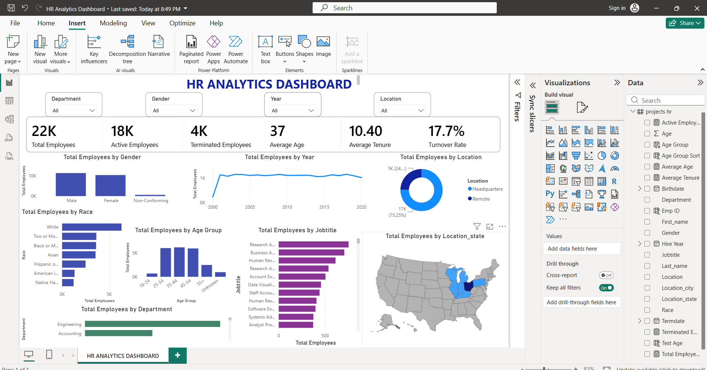

# 👥 HR Analytics Dashboard (SQL + Power BI)

## 📌 Project Overview

This project presents an interactive HR Analytics Dashboard built using SQL and Microsoft Power BI. It provides insights into employee attrition, workforce demographics, job roles, salary distribution, and overall HR performance.

---

## 🛠 Tools Used

- SQL
- Microsoft Power BI
- Power Query
- DAX

---

## 📊 Dashboard Features

- Employee Count
- Attrition Rate
- Department-wise Analysis
- Gender Distribution
- Age Group Analysis
- Salary Analysis
- Job Role Analysis
- Interactive Filters

---

## 📷 Dashboard Preview

---

## 📈 Key Insights

- Identified departments with higher employee attrition.
- Analyzed workforce distribution across job roles.
- Compared employee demographics and salary trends.
- Built interactive dashboards to support HR decision-making.

---

## 📁 Files Included

- hr_analytics_dashboard.pbix
- hr_analytics.sql
- hr_dashboard.png
- README.md

---

## 🚀 How to Open

1. Download the `.pbix` file.
2. Open it using Microsoft Power BI Desktop.
3. Review the dashboard and interact with the filters.

---

## 👤 Author

Anubhav Chhatriya
